# Introducción a R y visualización

##### ¿Qué es R? {-}

* R es un lenguaje de programación y un ambiente de cómputo estadístico
* R es software libre (no dice qué puedes o no hacer con el software), de código 
abierto (todo el código de R se puede inspeccionar - y se inspecciona).
* Cuando instalamos R, instala la base de R. Mucha de la funcionalidad adicional 
está en **paquetes** (conjunto de funciones y datos documentados) que la 
comunidad contribuye.

##### ¿Cómo entender R? {-}

* Hay una sesión de R corriendo. La consola de R es la interfaz 
entre R y nosotros. 
* En la sesión hay objetos. Todo en R es un objeto: vectores, tablas, 
 funciones, etc.
* Operamos aplicando funciones a los objetos y creando nuevos objetos.

##### ¿Por qué R? {-}

* R funciona en casi todas las plataformas (Mac, Windows, Linux e incluso en Playstation 3).
* R es un lenguaje de programación completo, permite desarrollo de DSLs.
* R promueve la investigación reproducible.
* R está actualizado gracias a que tiene una activa comunidad. Solo en CRAN hay 
cerca de $10,000$ paquetes (funcionalidad adicional de R creadas creada por la 
comunidad).
* R se puede combinar con otras herramientas.
* R tiene capacidades gráficas muy sofisticadas.
* R es popular ([Revolutions blog](http://blog.revolutionanalytics.com/popularity/)).

## R: primeros pasos  

Para comenzar se debe descargar [R](https://cran.r-project.org), esta descarga 
incluye R básico y un editor de textos para escribir código. Después de
descargar R se recomienda descargar 
[RStudio](https://www.rstudio.com/products/rstudio/download/) (gratis y libre).


Rstudio es un ambiente de desarrollo integrado para R: incluye una consola, 
un editor de texto y un conjunto de herramientas para administrar el espacio de
trabajo cuando se utiliza R. 

Algunos _shortcuts_ útiles en RStudio son:

**En el editor**  

* command/ctrl + enter: enviar código a la consola  
* ctrl + 2: mover el cursor a la consola

**En la consola**  

* flecha hacia arriba: recuperar comandos pasados  
* ctrl + flecha hacia arriba: búsqueda en los comandos  
* ctrl + 1: mover el cursor al editor  


### R en análisis de datos {-}

El estándar científico para contestar preguntas o tomar decisiones es uno que
se basa en el análisis de datos. Aquí consideramos técnicas cuantitativas: 
recolectar, organizar, entender, interpretar y extraer información de 
colecciones de datos predominantemente numéricos. Todas estas tareas son partes 
del análisis de datos, cuyo proceso podría resumirse con el siguiente diagrama:


Es importante la forma en que nos movemos dentro de estos procesos en el 
análisis de datos y en este curso buscamos dar herramientas para facilitar 
cumplir los siguientes principios:

1. **Reproducibilidad**. Debe ser posible reproducir el análisis en todos sus 
pasos, en cualquier momento.

2. **Claridad**. Los pasos del análisis deben estar documentados apropiadamente, 
de manera que las decisiones importantes puedan ser entendidas y explicadas 
claramente.

Dedicaremos las primeras sesiones a aprender herramientas básicas para poder 
movernos agilmente a lo largo de las etapas de análisis utilizando R y nos 
enfocaremos en los paquetes que forman parte del 
[tidyverse](http://tidyverse.org/).

### Paquetes y el Tidyverse {-}

La mejor manera de usar R para análisis de datos es aprovechando la gran
cantidad de paquetes que aportan funcionalidad adicional. Desde
Rstudio podemos instalar paquetes (Tools - > Install packages o usar la 
función `install.packages("nombre_paquete")`). Una vez instalados, podemos
cargarlos a nuestra sesión de R mediante `library`. Por ejemplo, para cargar el
paquete `readr` hacemos:


```r
# print(read_csv)
# Error in print(read_csv) : object 'read_csv' not found

library(tidyverse)
```

```
## Warning: package 'forcats' was built under R version 3.5.2
```

```r
print(read_csv)
```

```
## function (file, col_names = TRUE, col_types = NULL, locale = default_locale(), 
##     na = c("", "NA"), quoted_na = TRUE, quote = "\"", comment = "", 
##     trim_ws = TRUE, skip = 0, n_max = Inf, guess_max = min(1000, 
##         n_max), progress = show_progress()) 
## {
##     tokenizer <- tokenizer_csv(na = na, quoted_na = TRUE, quote = quote, 
##         comment = comment, trim_ws = trim_ws)
##     read_delimited(file, tokenizer, col_names = col_names, col_types = col_types, 
##         locale = locale, skip = skip, comment = comment, n_max = n_max, 
##         guess_max = guess_max, progress = progress)
## }
## <bytecode: 0x7fcbc6c6f3f0>
## <environment: namespace:readr>
```

`read_csv` es una función que aporta el paquete `readr`, que a su vez está incluido en el 
*tidyverse*. 

Los paquetes se instalan una sola vez, sin embargo, se deben cargar 
(ejecutar `library(tidyverse)`) en cada sesión de R que los ocupemos.

En estas notas utilizaremos la colección de paquetes incluídos en el 
[tidyverse](https://www.tidyverse.org/). Estos paquetes de R están
diseñados para ciencia de datos, y para funcionar juntos como parte de un flujo
de trabajo. 

La siguiente imagen tomada de [Why the tidyverse](https://rviews.rstudio.com/2017/06/08/what-is-the-tidyverse/) (Joseph 
Rickert) indica que paquetes del tidyverse se utilizan para cada
etapa del análisis de datos.


```r
knitr::include_graphics("imagenes/tidyverse.png")
```


### Recursos {-}
Existen muchos recursos gratuitos para aprender R, y resolver nuestras dudas, 
enlistamos algunos.

* Buscar ayuda: Google, [StackOverflow](http://stackoverflow.com/questions/tagged/r).  
* Para aprender más sobre un paquete o una función pueden visitar [Rdocumentation.org](http://www.rdocumentation.org/).    
* La referencia principal de estas notas es el libro [R for Data Science](http://r4ds.had.co.nz/)
de Hadley Wickham.  
* Para aprender los comandos básicos de R [*Try R*](http://tryr.codeschool.com/) 
y [Datacamp](https://www.datacamp.com/) cuentan con excelentes cursos 
interactivos.  
* Para aprender programación avanzada en R, el libro gratuito 
[Advanced R](http://adv-r.had.co.nz) de Hadley Wickham es una buena referencia. 
En particular es conveniente leer la [guía de estilo](http://adv-r.had.co.nz/Style.html) (para todos: principiantes, intermedios y avanzados).  
* Para mantenerse al tanto de las noticias de la comunidad de R pueden visitar 
[R-bloggers](http://www.r-bloggers.com).  
* Más del tidyverse: [Why the tidyverse](https://rviews.rstudio.com/2017/06/08/what-is-the-tidyverse/)  
* Para aprovechar la funcionalidad de [RStudio](https://github.com/rstudio/cheatsheets/raw/master/rstudio-ide.pdf).


## Visualización con ggplot2

Utilizaremos el paquete `ggplot2`, fue desarrollado por Hadley Wickham y es
una implementación de la gramática de las gráficas [@wilkinson2005]. 

#### Gráficas de dispersión {-}


```r
library(ggplot2) # Cargamos el paquete en nuestra sesión
```

Usaremos el conjunto de datos *mpg* que se incluye en R, puedes encontrar 
información de esta base de datos tecleando `?mpg`.


```r
data(mpg)
?mpg
glimpse(mpg)
```

```
## Observations: 234
## Variables: 11
## $ manufacturer <chr> "audi", "audi", "audi", "audi", "audi", "audi", "...
## $ model        <chr> "a4", "a4", "a4", "a4", "a4", "a4", "a4", "a4 qua...
## $ displ        <dbl> 1.8, 1.8, 2.0, 2.0, 2.8, 2.8, 3.1, 1.8, 1.8, 2.0,...
## $ year         <int> 1999, 1999, 2008, 2008, 1999, 1999, 2008, 1999, 1...
## $ cyl          <int> 4, 4, 4, 4, 6, 6, 6, 4, 4, 4, 4, 6, 6, 6, 6, 6, 6...
## $ trans        <chr> "auto(l5)", "manual(m5)", "manual(m6)", "auto(av)...
## $ drv          <chr> "f", "f", "f", "f", "f", "f", "f", "4", "4", "4",...
## $ cty          <int> 18, 21, 20, 21, 16, 18, 18, 18, 16, 20, 19, 15, 1...
## $ hwy          <int> 29, 29, 31, 30, 26, 26, 27, 26, 25, 28, 27, 25, 2...
## $ fl           <chr> "p", "p", "p", "p", "p", "p", "p", "p", "p", "p",...
## $ class        <chr> "compact", "compact", "compact", "compact", "comp...
```

Comencemos con nuestra primera gráfica:


```r
ggplot(data = mpg) + 
  geom_point(mapping = aes(x = displ, y = hwy)) 
```

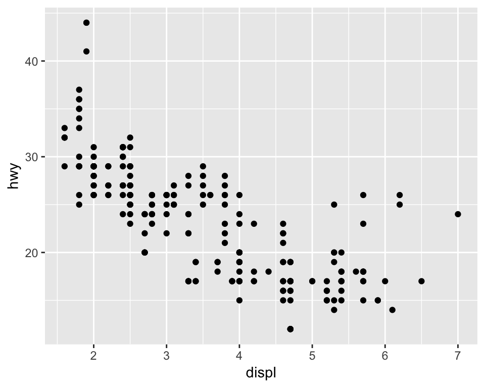

En `ggplot2` se inicia una gráfica con la instrucción `ggplot()`, debemos 
especificar explicitamente que base de datos usamos, este es el primer argumento 
en la función `ggplot()`. Una vez que creamos la base añadimos 
*capas*, y dentro de *aes()* escribimos las variables que queremos
graficar y el atributo de la gráfica al que queremos mapearlas. 

La función `geom_point()` añade una capa de puntos, hay muchas funciones
*geometrías* incluídas en `ggplot2`: `geom_line()`, `geom_boxplot()`, 
`geom_histogram`,... Cada una acepta distintos argumentos para mapear las 
variables en los datos a características estéticas de la gráfica. En el ejemplo 
de arriba mapeamos `displ` al eje x, `hwy` al eje y, pero `geom_point()` nos 
permite representar más variables usando la forma, color y/o tamaño del punto. 
Esta flexibilidad nos permite entender o descubrir patrones más interesantes en 
los datos.


```r
ggplot(mpg) + 
  geom_point(aes(x = displ, y = hwy, color = class))
```

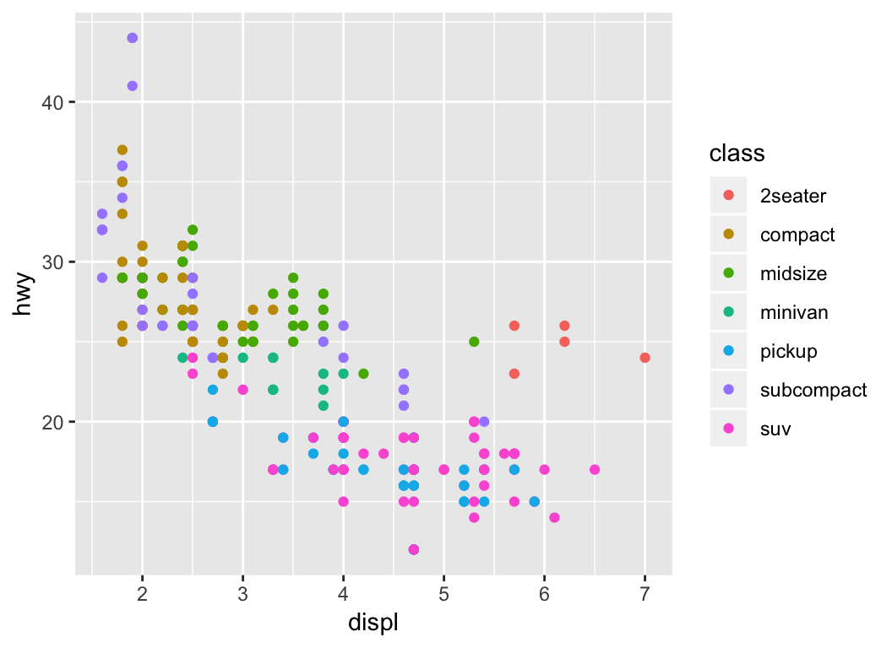

 Experimenta con los _aesthetics_ color (color), 
tamaño (size) y forma (shape).

&nbsp;&nbsp;&nbsp;&nbsp;&nbsp;&nbsp;&nbsp;&nbsp;&nbsp;&nbsp;&nbsp;  ¿Qué diferencia hay entre las variables categóricas y las continuas?

&nbsp;&nbsp;&nbsp;&nbsp;&nbsp;&nbsp;&nbsp;&nbsp;&nbsp;&nbsp;&nbsp;  ¿Qué ocurre cuando combinas varios _aesthetics_?

El mapeo de las propiedades estéticas se denomina escalamiento y depende del 
tipo de variable, las variables discretas (por ejemplo, genero, escolaridad, 
país) se mapean a distintas escalas que las variables continuas (variables 
numéricas como edad, estatura, etc.), los *defaults* para algunos atributos son
(los escalamientos se pueden modificar):


aes       |Discreta      |Continua  
----------|--------------|---------
Color (`color`)|Arcoiris de colores         |Gradiente de colores  
Tamaño (`size`)  |Escala discreta de tamaños  |Mapeo lineal entre el área y el valor  
Forma (`shape`)    |Distintas formas            |No aplica
Transparencia (`alpha`) | No aplica | Mapeo lineal a la transparencia   

Los *_geoms_* controlan el tipo de gráfica


```r
p <- ggplot(mpg, aes(x = displ, y = hwy))
p + geom_line() # en este caso no es una buena gráfica
```

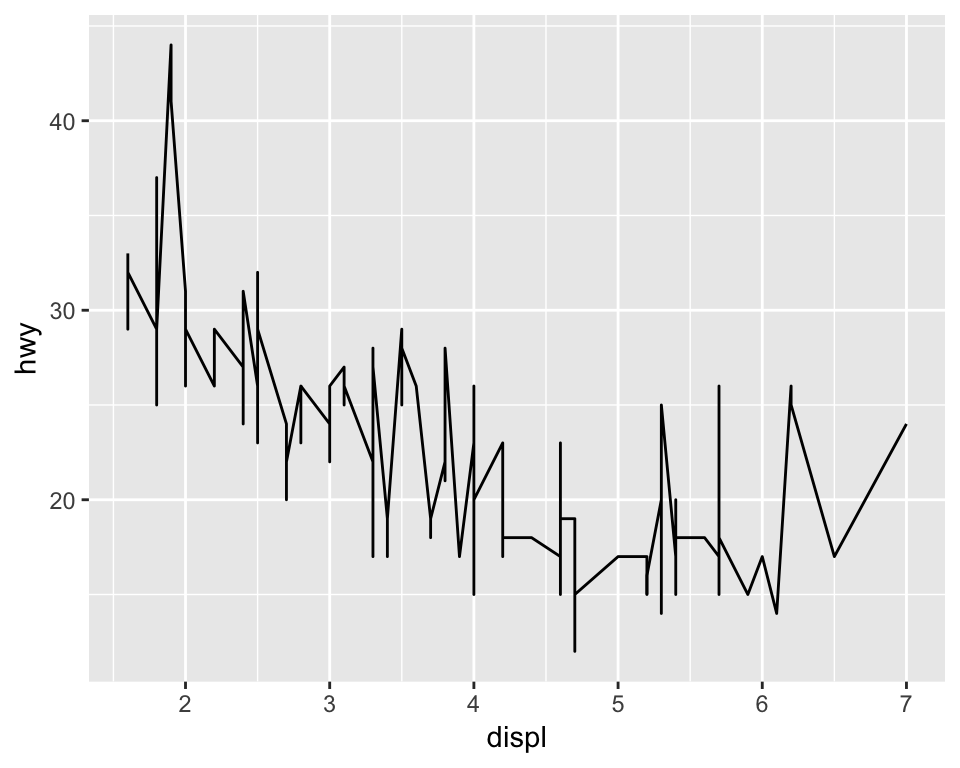

¿Qué problema tiene la siguiente gráfica?


```r
p <- ggplot(mpg, aes(x = cty, y = hwy))
p + geom_point() 
```

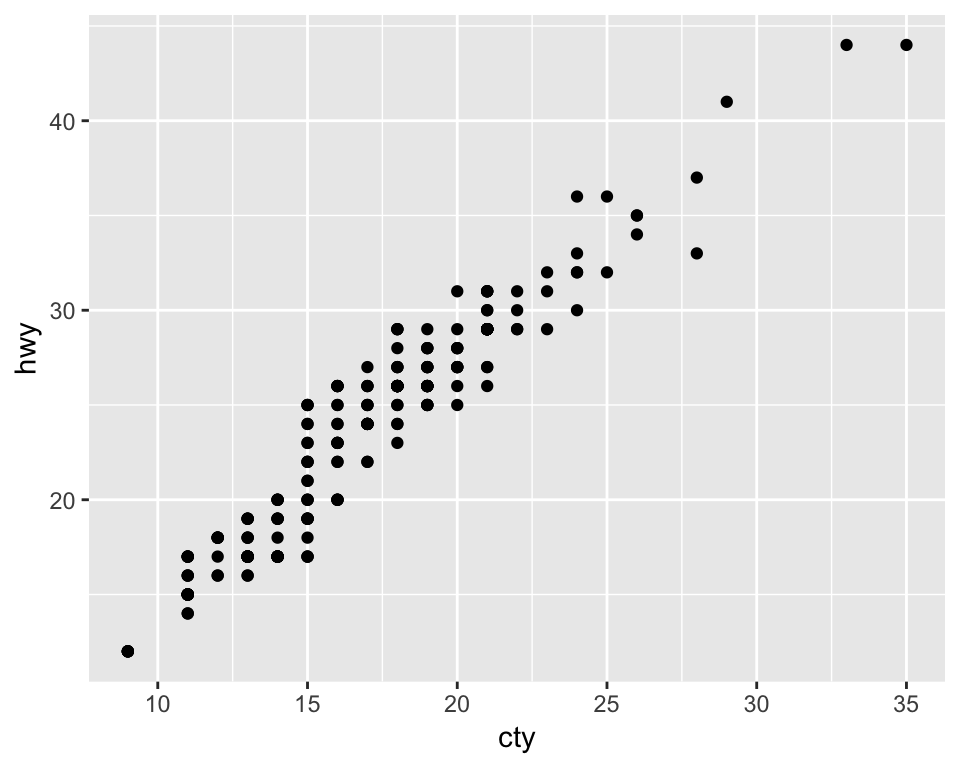

```r
p + geom_jitter() 
```


 ¿Cómo podemos mejorar la siguiente gráfica?


```r
ggplot(mpg, aes(x = class, y = hwy)) + 
  geom_point() 
```

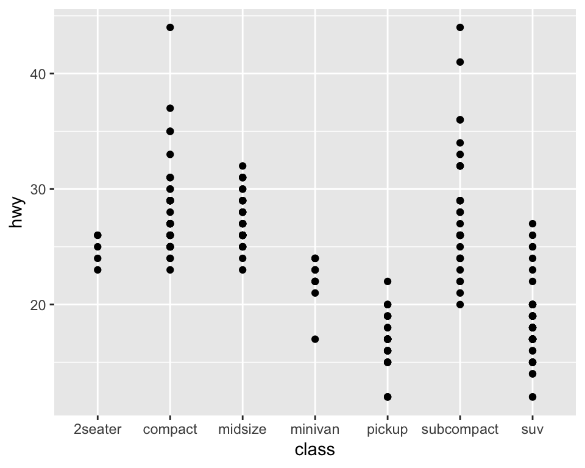

Intentemos reodenar los niveles de la variable clase


```r
ggplot(mpg, aes(x = reorder(class, hwy), y = hwy)) + 
    geom_point() 
```

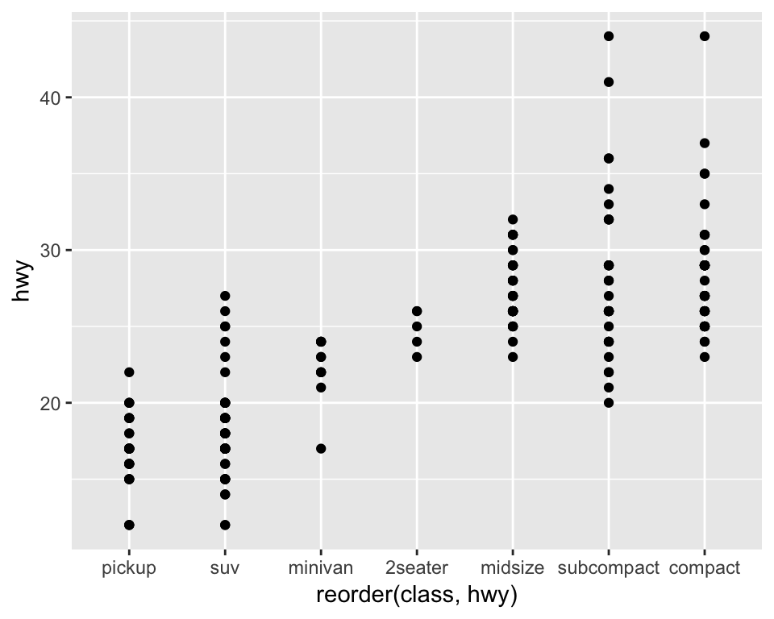

Podemos probar otros geoms.


```r
ggplot(mpg, aes(x = reorder(class, hwy), y = hwy)) + 
    geom_jitter() 
```

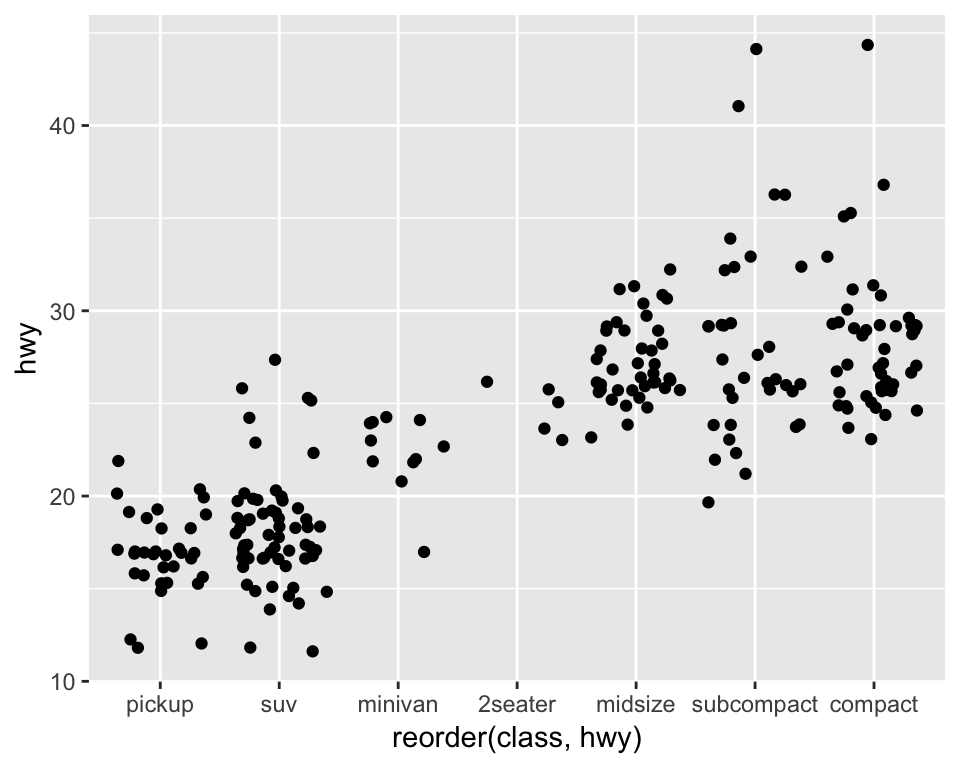

```r
ggplot(mpg, aes(x = reorder(class, hwy), y = hwy)) + 
    geom_boxplot() 
```


También podemos usar más de un geom!


```r
ggplot(mpg, aes(x = reorder(class, hwy), y = hwy)) + 
    geom_jitter() +
    geom_boxplot()
```

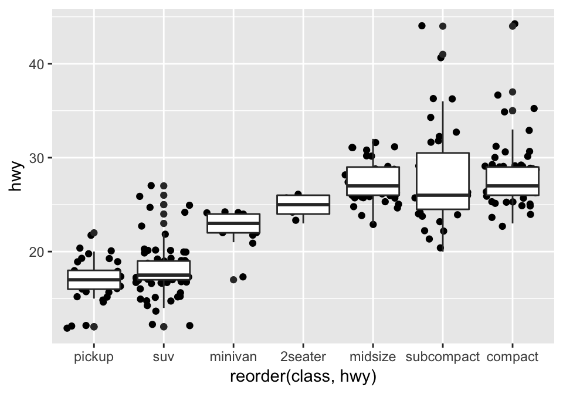

 Lee la ayuda de _reorder_ y repite las gráficas 
anteriores ordenando por la mediana de _hwy_.

&nbsp;&nbsp;&nbsp;&nbsp;&nbsp;&nbsp;&nbsp;&nbsp;&nbsp;&nbsp;&nbsp; ¿Cómo harías
para graficar los puntos encima de las cajas de boxplot?

#### Paneles {-}
Veamos ahora como hacer páneles de gráficas, la idea es hacer varios múltiplos 
de una gráfica donde cada múltiplo representa un subconjunto de los datos, es 
una práctica muy útil para explorar relaciones condicionales.

En ggplot podemos usar _facet\_wrap()_ para hacer paneles dividiendo los datos 
de acuerdo a las categorías de una sola variable


```r
ggplot(mpg, aes(x = displ, y = hwy)) + 
  geom_jitter() +
  facet_wrap(~ cyl)
```

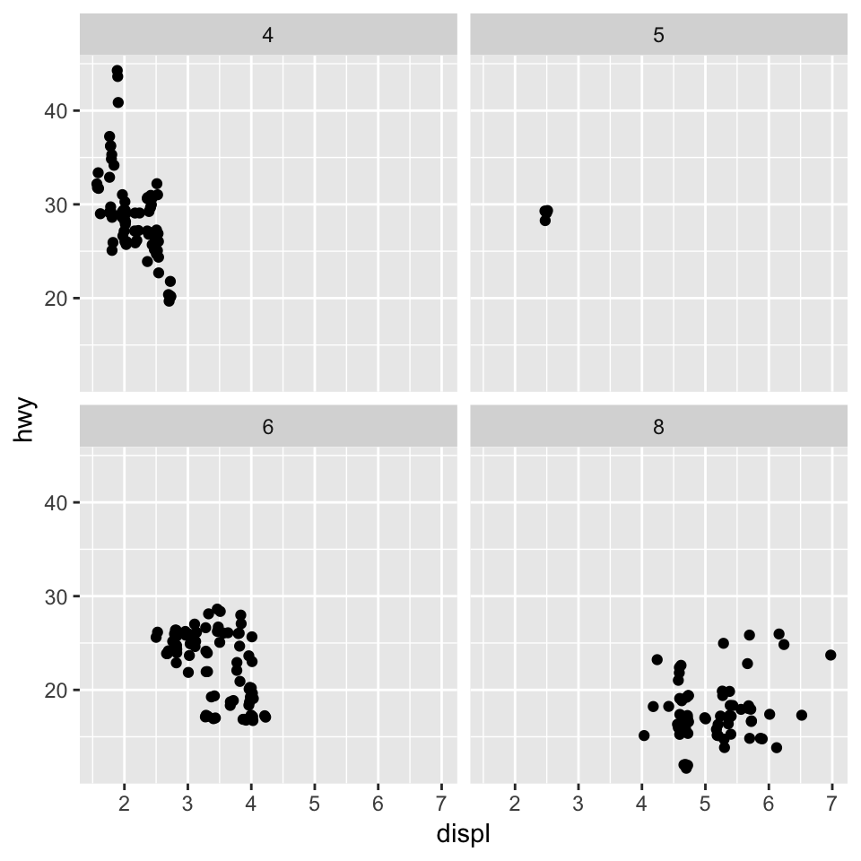

También podemos hacer una cuadrícula de $2$ dimensiones usando 
_facet\_grid(filas~columnas)_ 


```r
ggplot(mpg, aes(x = displ, y = hwy)) + 
  geom_jitter() +
  facet_grid(.~ class)
```

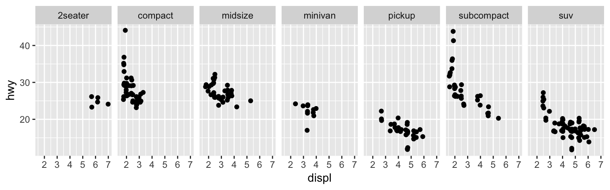


```r
ggplot(mpg, aes(x = displ, y = hwy)) + 
  geom_jitter() +
  facet_grid(drv ~ class)
```

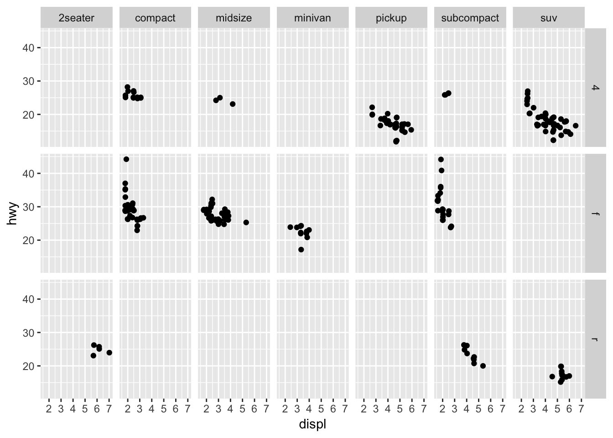

Los páneles pueden ser muy útiles para entender relaciones en nuestros datos. En 
la siguiente gráfica es difícil entender si existe una relación entre radiación
solar y ozono.


```r
data(airquality)
ggplot(airquality, aes(x = Solar.R, y = Ozone)) + 
  geom_point() 
```

```
## Warning: Removed 42 rows containing missing values (geom_point).
```

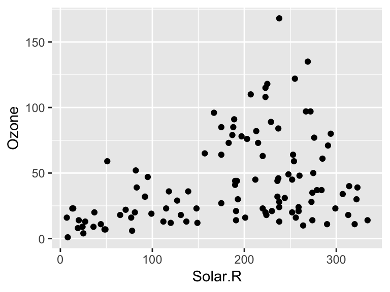

Veamos que ocurre si realizamos páneles separando por velocidad del viento.


```r
library(Hmisc)
airquality$Wind.cat <- cut2(airquality$Wind, g = 3) 
ggplot(airquality, aes(x = Solar.R, y = Ozone)) + 
  geom_point() +
  facet_wrap(~ Wind.cat)
```

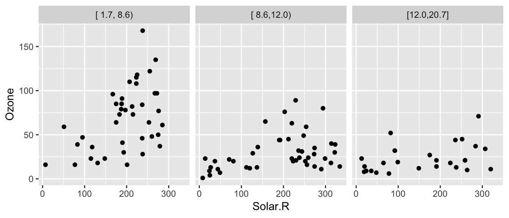

Podemos agregar un suavizador (loess) para ver mejor la relación de las 
variables en cada panel.

```r
ggplot(airquality, aes(x = Solar.R, y = Ozone)) + 
  geom_point() +
  facet_wrap(~ Wind.cat) + 
  geom_smooth(method = "lm")
```

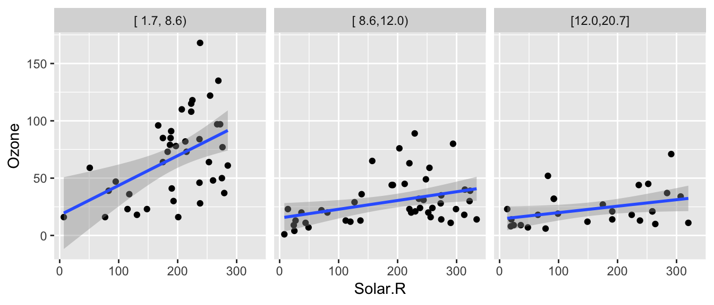

 Escribe algunas preguntas que puedan contestar con 
estos datos.

En ocasiones es necesario realizar transformaciones u obtener subconjuntos de 
los datos para poder responder preguntas de nuestro interés.


```r
library(dplyr)
library(babynames)
```

```
## Warning: package 'babynames' was built under R version 3.5.2
```

```r
glimpse(babynames)
```

```
## Observations: 1,924,665
## Variables: 5
## $ year <dbl> 1880, 1880, 1880, 1880, 1880, 1880, 1880, 1880, 1880, 188...
## $ sex  <chr> "F", "F", "F", "F", "F", "F", "F", "F", "F", "F", "F", "F...
## $ name <chr> "Mary", "Anna", "Emma", "Elizabeth", "Minnie", "Margaret"...
## $ n    <int> 7065, 2604, 2003, 1939, 1746, 1578, 1472, 1414, 1320, 128...
## $ prop <dbl> 0.07238359, 0.02667896, 0.02052149, 0.01986579, 0.0178884...
```

Supongamos que queremos ver la tendencia del nombre "John", para ello debemos 
generar un subconjunto de la base de datos. ¿Qué ocurre en la siguiente gráfica?


```r
babynames_John <- filter(babynames, name == "John")
ggplot(babynames_John, aes(x = year, y = prop)) +
  geom_point()
```

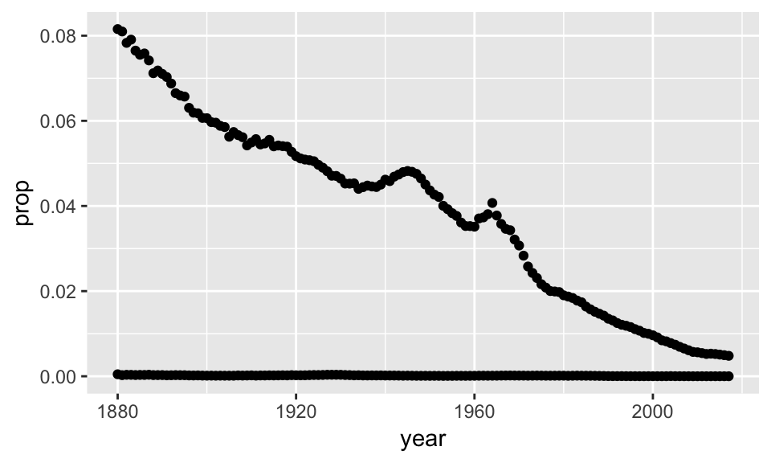


```r
ggplot(babynames_John, aes(x = year, y = prop, color = sex)) +
  geom_line()
```

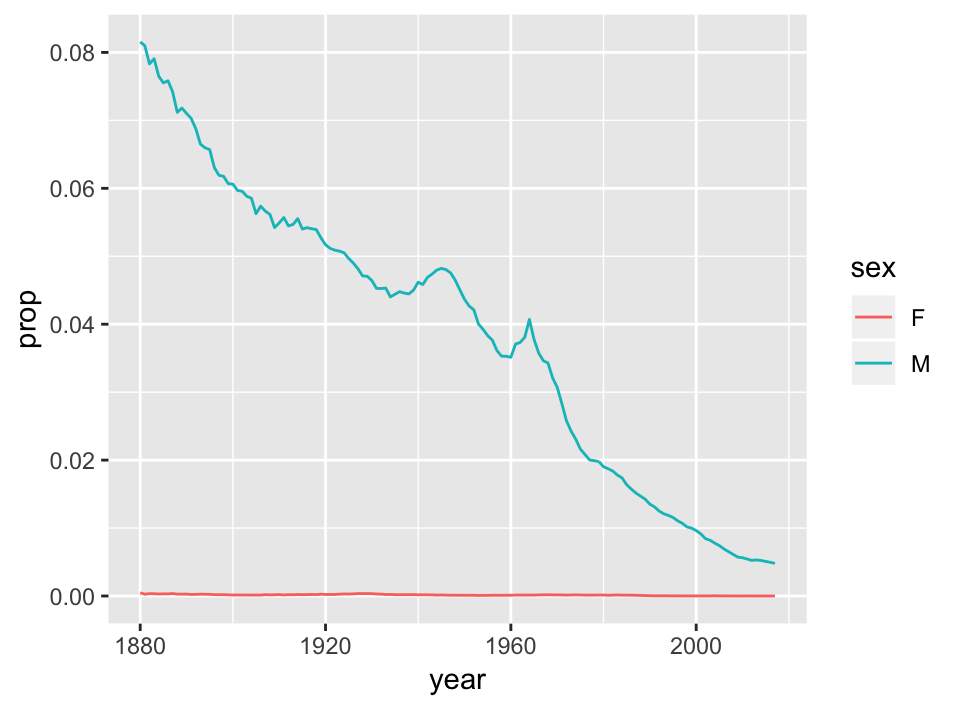

La preparación de los datos es un aspecto muy importante del análisis y suele 
ser la fase que lleva más tiempo. Es por ello que el siguiente tema se enfocará 
en herramientas para hacer transformaciones de manera eficiente.


 Explora la base de datos gapminder, estos 
datos están incluidos en el paquete del mismo nombre, para acceder a ellos basta 
con cargar el paquete:


```r
# install.packages("gapminder")
library(gapminder)
gapminder
```

```
## # A tibble: 1,704 x 6
##    country     continent  year lifeExp      pop gdpPercap
##    <fct>       <fct>     <int>   <dbl>    <int>     <dbl>
##  1 Afghanistan Asia       1952    28.8  8425333      779.
##  2 Afghanistan Asia       1957    30.3  9240934      821.
##  3 Afghanistan Asia       1962    32.0 10267083      853.
##  4 Afghanistan Asia       1967    34.0 11537966      836.
##  5 Afghanistan Asia       1972    36.1 13079460      740.
##  6 Afghanistan Asia       1977    38.4 14880372      786.
##  7 Afghanistan Asia       1982    39.9 12881816      978.
##  8 Afghanistan Asia       1987    40.8 13867957      852.
##  9 Afghanistan Asia       1992    41.7 16317921      649.
## 10 Afghanistan Asia       1997    41.8 22227415      635.
## # ... with 1,694 more rows
```

&nbsp;&nbsp;&nbsp;&nbsp;&nbsp;&nbsp;&nbsp;&nbsp;&nbsp;&nbsp;&nbsp; realiza al 
menos $3$ gráficas y explica las relaciones que encuentres. Debes usar lo que 
revisamos en estas notas: al menos una de las gráficas debe ser de páneles, 
realiza una gráfica con datos de México, y (opcional)si lo consideras 
interesante, puedes crear una variable categórica utilizando la función `cut2` 
del paquete Hmisc. 


### Recursos {-}
* El libro *R for Data Science* [@r4ds] tiene un capítulo de visualización.
* Google, [stackoverflow](https://stackoverflow.com/questions/tagged/ggplot2) 
tiene un *tag* para ggplot2.  
* Documentación con ejemplos en la página de 
[ggplot2](http://ggplot2.tidyverse.org/).
* Otro recurso muy útil es el 
[acordeón de ggplot](https://github.com/rstudio/cheatsheets/raw/master/data-visualization-2.1.pdf).  
* La teoría detrás de ggplot2 se explica en el libro de ggplot2 [@wickham2009],

