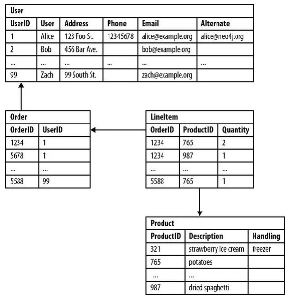
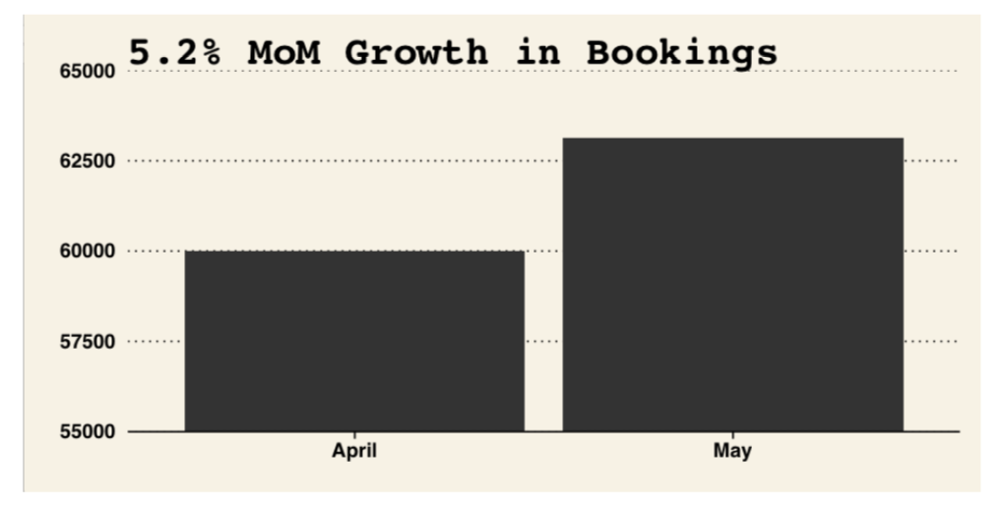
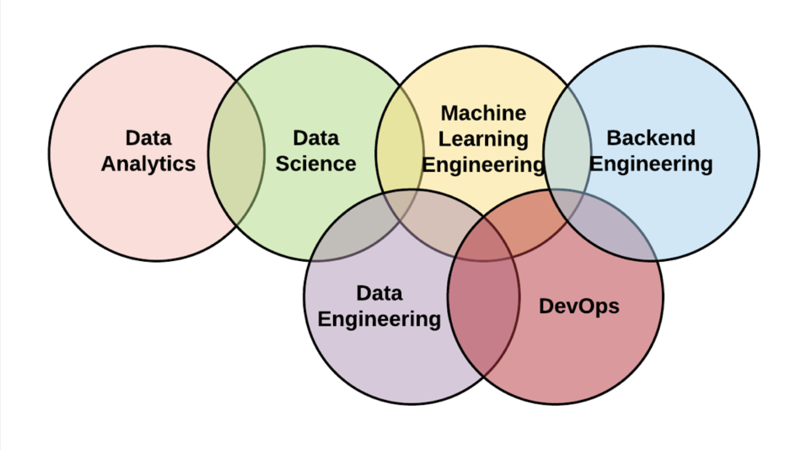
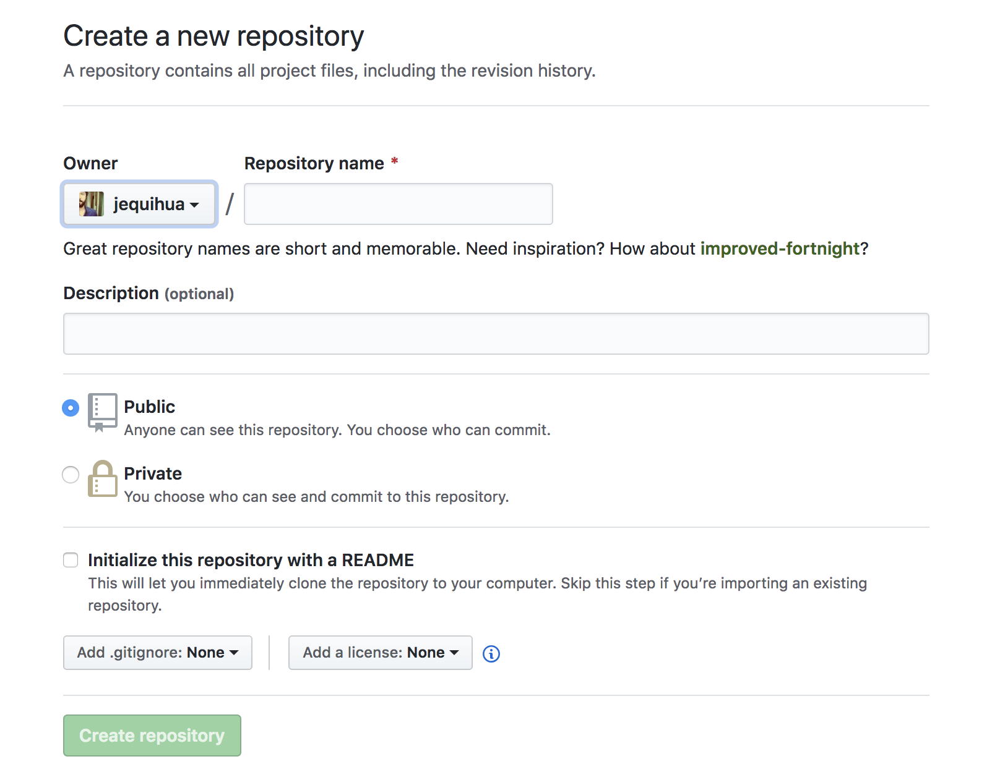
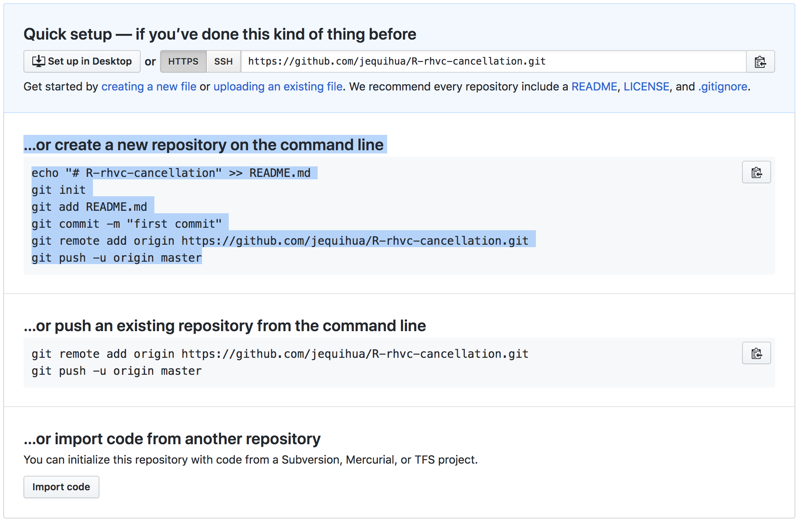

# Clase miércoles 18/marzo/2019 Inecol

* ¿Qué es Big Data?
* ¿Cómo convertirse en una organización que toma decisiones basadas en datos?
* ¿Qué es ciencia de datos?
* Práctica: introducción a control de versiones

## Big Data

Big data es un término que no está definido estrictamente. Es utilizado para describir un gran volumen de datos estructurados y/o no-estructurados. 

La mayoría de los científicos y personas de Tecnologías de la Información están acostumbrados a trabajar con datos estructurados. Estos son simplemente datos que están escritos en un formato que es fácilmente comprensible por las computadoras y que por tanto se pueden procesar con algoritmos básicos. Este tipo de datos entra de manera natural en una base de datos relacional (ahondaremos un poco en esto más adelante) puesto a que se pueden asociar los datos de manera inequívoca a campos fijos.  

{width=60%}

Los datos no-estructurados son aquellos que no pueden sencillamente asociarse a una estructura anterior. Ni siquiera claramente asociarle campos porque naturalmente no están asociados a un modelo de datos. Ejmplos de esto: presentaciones de powerpoint, archivos PDF, tweets, videos digitales. 

 Tómense 10 minutos para pensar en 2 ejemplos de datos estructurados y 2 de datos no-estructurados en biodiversidad. Anotar por qué son el uno o el otro.

Ahora bien, anuque el término Big Data es relativamente nuevo, producir y almacenar relativamente grandes cantidades de datos para llevar a cabo análisis es una práctica antigua. El concepto Big Data se popularizó a principio de los años 2000s cuando el analista Doug Laney articuló una definición de Big Data conocida como las tres V's:

* Volumen: las organizaciones colectan simultáneamente datos de múltiples fuentes.

* Velocidad: los flujos de datos son cada vez más veloces, por ejemplo datos provenientes de sensores nos otorgan datos prácticamente en tiempo real.

* Variedad: los datos vienen en todo tipo de formatos, estructurados y no-estrucutrados.

A este se han agregado otras características que es importante tener en mente, sobre todo en ecología, biodiversidad, etc

* Variabilidad: además de la creciente velocidad y variabilidad de datos, los flujos de datos tienden a ser muy inconsistentes, por ejemplo con grandes sesgos temporales y espaciales. 

* Complejidad: los datos cada vez vienen de más fuentes, lo cuál los hace difícil limpiarlos, transformarlos, asociarlos y unificarlos para poder meterlos a un solo sistema para luego ser analizados en conjunto.

 Tómense 10 minutos para formular un ejemplo de análisis de datos en el tema de biodiversidad donde se requieren múltiples fuentes de datos, describir de dónde provienen tales datos, su velocidad, variabilidad y complejidad.

Ahora hay que aclarar que el Big Data no es valioso en sí mismo. Realmente no importa la cantidad de datos que se tienen, lo que importa es lo que hacen las organizacions con ellos. Lo importante es que el Big Data tiene el potencial de generar conocimiento que lleve a mejores decisiones y estrategias.

## ¿Cómo convertirse en una organización que toma decisiones basadas en datos?

Algo que es común observar (al menos en este hermoso país)  es que los datos generados por las agencias gubernamentales terminan en un sin fin de reportes, rara vez se utilizan para la toma de decisiones. Se van publicando paulatinamente datos y reportes pero su impacto sobre decisiones futuras y ,por ejemplo, política pública, no es claro. Estos reportes son, generalmente, una mera declaración de hechos presentes o pasados, sin mucho contexto y sin una explicación causal de por qué algo ha sucedido o no ha sucedido. Por supuesto sin recomendaciones de qué hacer después. Sin duda los datos y los reportes son escenciales para la toma de decisiones, por sí solos no logran mucho.

Cuando una organización está impulsada por datos diremos que es data-driven. No existe una palabra en español para referise a esto así que usaremos el término en inglés. 

La Data-drivenness emerge de múltiples cosas, pero final del día hay que tener en mente que volverse una organización impulsada por datos es una decisión estratégica y operacional, no es sólo una cuestión tecnológica. Es crucial generar una cultura en la que las personas actúan con base en datos. Por supuesto que para lograr esto hace falta construir herramientas y habilidades que permitan lo anterior.

 Tómense 10 minutos para leer la siguiente [carta](
https://stopdesign.com/archive/2009/03/20/goodbye-google.html).

### Recolección y acceso a datos  

* Una organización debe estar recolectando datos.

No se deben estar recolectando cualquier tipo de datos. Deben ser los datos, potencialmente, correctos. Esto es, que al menos en potencia, puedan permitir contestar preguntas o abordar temas de interés. Por otro lado, idealmente, deben ser datos oportunos, exactos, limpios e insesgados.

* Los datos deben ser consultables.

Debe haber un mecanismo estándar y lógico para acceder y buscar subconjuntos de interés del universo de datos disponible.

* Los datos deben poder unir (joinable).

Sobretodo cuando se quiere trabajar con datos de fuentes diversas, se debe de poder asociar los datos para colocarlos en una misma estructura que permita generar reportes o análisis.

* Los datos se deben poder compartir.

Debe existir una cultura de compartir datos dentro de la organización, muchas veces entre diferentes organizaciones. Esto para que datos diversos puedan unirse. 

Poniendo un ejemplo un tanto simple, supongamos que un paciente es tratado en un hospital pero al ser dado de alta debe ir a revisiones periódicas en otra clínica. El paciente recibirá peor servicio al cliente y, más importante aún, un peor tratamiento si el hospital y la clínica no comparten datos.

### Reportes y alertas

Supongamos que tenemos un grupo que hace analítica y que este tiene acceso a datos relativamente limpios y consultables. El grupo extrae datos de ventas y reporta:

{width=60%}

 Tómense 10 minutos para pensar en qué tan informativa es esta gráfica y qué tan fuerte la conclusón ¿por qué?

Una alerta es un reporte de algo que está sucendiente EN ESTE MOMENTO. Sufre de las mismas desventajas que un reporte, esto es, no da nada de información contextual. Pero puede ser sumamente útil e incluso necesario para lograr ciertos propósitos ¿Quién no quisiera una alerta de deforestación en casi tiempo real? Desgraciadamente, la complejidad tecnológica que implica producir alertas es generalmente significativamente mayor que la de reportes. 

### De reportes y alertas a análisis

Por supuesto la capacidad de generar reportes y alertas es una condición necesaria para ser una organización impulsada por datos. Pero no es suficiente, los reportes y alertas son descriptivos, pero muchas veces se necesita algo prescriptivo. 

En el año 2009, Jim Davis, el senior vice president y chief marketing officer del instituto SAS postuló ocho niveles de analítica:

* Reportes estándar: ¿Qué pasó? ¿Cuándo?
* Reportes Ad Hoc: ¿Cuántas veces ha pasado? ¿Qué tan seguido pasa?
* Consultas especializadas: ¿Exactamente en qué población se dió el problema?
* Alertas: ¿Cuándo debería de reaccionar?
* Análisis estadístico: ¿Por qué está sucediendo esto? 
* Previsión: ¿Qué va a suceder si estas tendencias continúan? ¿Cuánto se va a necesitar? ¿Cuándo?
* Modelos predictivos: ¿Qué va a suceder después? 
* Optimización: ¿Cómo podemos hacer mejor las cosas? Ante un problema complejo ¿Cuál es la mejor estrategia?

 Tómense 10 minutos para pensar en un análisis de cada uno de estos tipos desde el contexto en el que laboran (como científicos, trabajadores en una agencia gubernamental, etc)

### Tecnología

Ya se mencionó que convertirse en una organización impulsada por datos no es meramente una cuestión tecnológica, pero sin duda la tecnología es un factor necesario para lograrlo. Para llegar a los distintos niveles de analítica antes propuestos se requieren de flujos de trabajo que generalmente se separan en tres componentes:

* Back-end (el punto de partida, las bases de datos y procesos de gestión, transformación y consulta de las mismas)
* Middleware (lo que une el Back-end con aplicaciones)
* Front-end (lo que se presenta al cliente, por ejemplo un dashboard)

Cada uno requiere habilidades especiales para desarrollarse y utilizarse, en una organización se requieren especialistas que sepan sobre estas componentes, muchas veces de una manera no-disjunta.

Por si fuera poco, los componentes anteriores se refieren a cosas distintas dependiendo de la aplicación en cuestión. Por ejemplo un desarrollador back-end:

* Si estás trabajando para una compañía que hace su propio back-end, entonces se refiere a alguien que genera la infraestructura donde se alojan datos (base de datos).
* En una compañía que trabaja con Big Data podría significa alguien que sabe utilizar los distintos productos que ofrece una compañía de cómputo en la nube.
* En una compañía que hace web apps es la persona que escribe el código para interactuar con las bases de datos.

Una empresa moderna de analítica mantiene cada vez roles más especializados.

{width=80%}

* Backend engineering: Diseño y construcción de bases de datos. Así como la gestión de las mismas. Debe poder entregar datos requeridos por clientes internos en formatos que faciliten el trabajo de los mismos.
* Machine learning engineering: Desarrollo de modelos de inteligencia artificial que sirvan tanto para llevar a cabo análisis de datos (predicción e inferencia) como para la automatización de tareas.
* Data science: Entendimiento profundo de problemas de negocio para poder generar insights a través de métodos analíticos y visualización de datos. “Genera sus propias preguntas”.
* Data analytics: Entendimiento profundo de problemas de negocio para poder llevar a cabo una curaduría fina de insights. “Propone respuestas novedosas a preguntas dadas”.
* Dev ops: Alguien que diseña y supervisa el conjunto de prácticas que tienen como intención reducir el tiempo entre que se propone un cambio a un sistema y que el cambio se implementa. 
* Data engineering: Su rol principal es desarrollar herramientas que hagan que los datos crudos sean más útiles para la empresa. Es responsable de desarrollar, mantener y optimizar las herramientas que permiten el acceso y consulta de datos para clientes internos. 

Para estos momentos debe ser evidente que una gran parte de lo planteado se centra en ejercicios que son primordialmente desarrollo de software.

## ¿Qué es ciencia de datos?

{width=80%}

“Un científico de datos es un estadístico que puede programar.”

"Persona que sabe más de estadística que cualquier programador y que a la vez sabe más de programación que cualquier estadístico". 

La ciencia de datos es un “concepto para unificar estadísticas, análisis de datos, machine learning y sus métodos relacionados”, para “entender y analizar fenómenos reales” con datos.

Un científico de datos es un profesional dedicado a analizar e interpretar grandes bases de datos. 

“La ciencia de datos es la disciplina de hacer que los datos sean útiles.”

## Práctica: introducción a control de versiones

Prerrequisios:

* Instalar R
* Instalar RStudio
* Instalar Git
* Hacer una cuenta en GitHub

Vamos a enfocarnos en Git que es el sistema de control de versiones más popular.

El control de versiones es software que permite a individios, equipos u organizaciones enteras administrar su código (software también). Monitorea cambios a un proyecto para que si algo se rompe puedas comparar entre la versión actual del proyecto y una anterior. Incluso puedes retomar una versión anterior del proyecto ("checkout"). También permite trbajar en distintas "ramas" de un mismo proyecto para poder trabajar en distintas "versiones" del mismo simultáneamente. Por ejemplo un programador puede tener asignado una tarea en particular, al mismo tiempo que otro debe trabajar en otra tarea de programación. Cuando terminen, con Git y con un poco de suerte ambas se pueden integrar a la "rama" principal. 

{width=70%}

GitHub es una plataforma online que aloja proyectos de Git, esto es; proyectos de programación. Es útil cuando tienes a múltiples personas trabajando en el mismo proyecto. Por supuesto también es una excelente manera de siempre tener un respaldo de tu proyecto.

Primero crearemos un repositorio nuevo en GitHub, debemos de hacer login a nuestra cuenta de GitHub recien creada y en la esquina superior derecha (signo +) elegir la opción de crear un nuevo repositorio.

{width=60%}

Ahora ya tenemos un repositorio creado en un servidor remoto, pero está vacío. Una manera de proseguir es trabajar algo localmente y luego subirlo ahí.

Vamos a crear un script de R, en una carpeta en nuestra computadora para después subirlo ahí.

Abramos RStudio y generemos un script cualquiera para luego guardarlo en una carpeta que estará asociado a ese repositorio remoto. Conviene que el repositorio remoto y esta carpeta se llamen igual.

Luego desde la línea de comandos de nuestra computadora debemos navegar hasta esa carpeta y llevar a cabo lo que nos indica GitHub.

{width=60%} 

 Tómense 10 minutos para generar parejas y vamos a explicar una dinámica de colaboración en repositorios (Git + GitHub).

