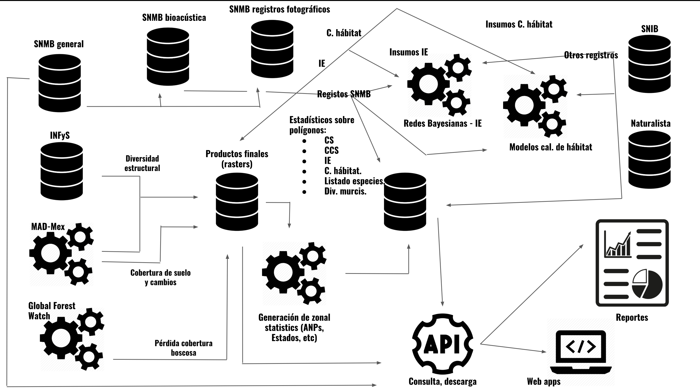
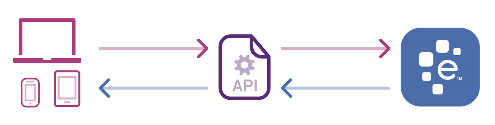
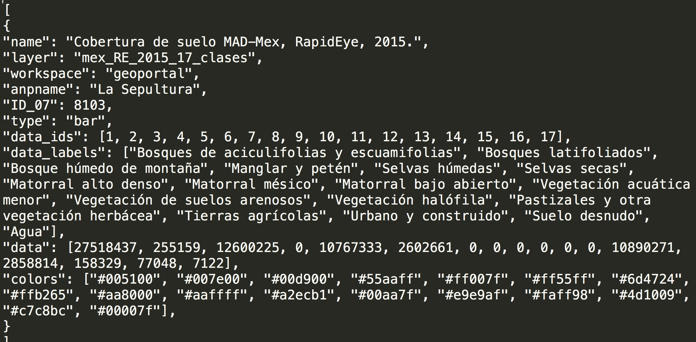
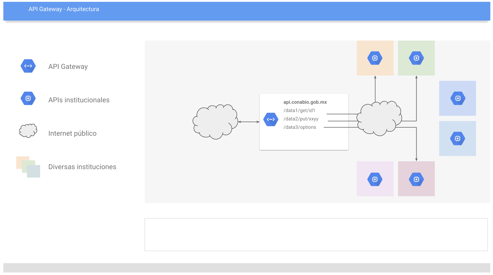

# Clase Jueves 21/marzo/2019 Inecol

* Pipelines
* APIs
* ¿Cómo escoger tecnología?

## Pipelines
### ¿Qué es un pipeline?

Llanamente es un secuencia de procesos y pasos analíticos aplicados a datos para un propósito particular.

Por ejemplo:
* Obtener datos (e.g. a través de una encuesta y trabajo de campo)
* Ordenar y limpiar tales datos (e.g. capturar las encuestas y producir una tabla de datos)
* Explorar/Visualizar los datos de maneras que nos permitan encontrar ahí patrones
* Generar modelos que permitan inferencias más informativas (e.g. una segmentación de las personas encuestadas)
* Interpretar todos los resultados y presentarlos (e.g. reportes, infografías, dashboards)

### Un ejemplo

Por ejemplo el [gobierno de Inglaterra](https://dataingovernment.blog.gov.uk/2017/03/27/reproducible-analytical-pipeline/) está utilizando R para generar reportes oficiales.

Ellos plantearon, un pipeline para generar reportes se ve más o menos así:

{width=80%}

Esto generaba reportes poco reproducibles porque los pasos entre los Datos y los PDFs se generaban de manera manual, por ejemplo escribir y estructurar el reporte en word, lo cuál también con lleva costos elevados. 

Por esto, el equipo encargado de esto se unió con desarroladores de software y con gente de DevOps (¿quién se acuerda qué hacía un DevOps?) con dos objetivos principales:

* Our aim was to see if we could speed up production of the SFR, whilst maintaining the high standard of the publication and QA.
* At any point in the future we should be able to look back at this work and be able to reproduce everything that we have done today

Ahí comentan que finalmente se decidieron por hacer esto en R pero que bien lo pudieron hacer en Python o en otro lenguaje de programación: the techniques we outline below are language agnostic.

{width=80%}

* Control de versiones
* Empaquetar código
* Procedural programming y unit testing
* Automated Testing
* Code coverage
* Manejo de dependencias
* Verificación de problemas en datos
* Producir la publicación (reporte)

Lograr un buen balance: Aunque esta manera de trabajar es increíblemente poderosa, no se debe de tomar como la panacea para todos los contextos de producción de reportes, existe un balance que se debe lograr entre los objetivos en cuestión, el grado de automatización que se desea y la dificultad y costos de mantenimiento. Dejando eso dicho, implementar al menos algunos de las cosas anteriores con seguridad trae consigo mejoras en auditabilidad, velocidad, calidad y transferencia de conocimiento.

 Formen equipos de 3 y bosquejen un pipeline de algun proyecto que ya estén trabajando o uno hipotético.

### Muchos pipelines

En la Dirección General de Proyectos Interinstitucionales conviven varios pipelines de diversas naturalezas:

* Recibir, ordenar, limpiar y gestionar datos
* Analizar datos
* Presentar y diseminar datos

(Recordar primera clase)

{width=80%}

[Aquí](https://monitoreo.conabio.gob.mx/) pueden consultar una página con las etapas finales de estas pipeplines (presentación y consulta de datos).

## APIs
### ¿Qué es una API?

{width=80%}

API - Application Programming Interface

*Es la definición o contrato que el dueño de un software o sistema promete a los usuarios de éste
*Especifica con claridad qué servicios se ofrecen y cómo se puede hacer uso de ellos
*Aplica para data y procesos.
*En este contexto, se refiere a un punto de acceso remoto, a través del Internet
*Aísla los detalles de implementación (versión de software, lenguaje, base de datos, etc)

 En los mismos equipos de Formen equipos de 3 revisar las siguientes APIs y discutir qué consideran que es una API, redactar un párrafo plasmando esto:
*[iNaturalist](https://www.inaturalist.org/pages/api+reference)
*[Google geocoding](https://developers.google.com/maps/documentation/geocoding/start)
*[Comisión nacional de energía (Chile)](http://datos.energiaabierta.cl/developers/)
*[INEGI (México)](https://www.inegi.org.mx/servicios/api_biinegi.html)

### ¿Qué es un archivo JSON?

{width=80%}

JSON es el acrónimo para JavaScript Object Notation, y aunque su nombre lo diga, no es necesariamente parte de JavaScript, de hecho es un estándar basado en texto plano para el intercambio de información, por lo que se usa en muchos sistemas que requieren mostrar o enviar información para ser interpretada por otros sistemas, la ventaja de JSON al ser un formato que es independiente de cualquier lenguaje de programación, es que los servicios que comparten información por éste método, no necesitan hablar el mismo idioma, es decir, el emisor puede ser Java y el receptor PHP, cada lenguaje tiene su propia librería para codificar y decodificar cadenas de JSON.

{width=80%}

 En los mismos equipos de 3 y retomando su pipeline propuesto, indicar qué partes se podrían solucionar con una API.

### Organizando organizaciones con APIs

API Gateway - Pasarela a otras APIs

* La idea central es que en la dirección de internet que se promociona, no residen datos o se ejecutan procesos
* Todos están en otros servidores y lugares diferentes
* Pero se puede acceder a todos desde la misma pasarela (Gateway)

Gobierno de datos

* Es mucho más amplio que sólo un sistema
* Relación estrecha con el modelo organizacional, tanto del proyecto como de las instituciones involucradas
* Relación estrecha con las fuentes, destino y uso de los datos y procesos
* La configuración del sistema de API Management puede (y debe) evolucionar conforme vaya evolucionando el modelo del gobierno de datos.

{width=80%}

Ventajas
* La data y procesos siempre está a cargo de cada institución.
* Los consumidores utilizan un sólo punto de acceso.
* Características técnicas predecibles para el consumidor.
Retos
* Cada institución debe mantener sus procesos y data.
* El contrato del API no debe romperse.
* El nivel de servicio (SLA) debe cumplirse.
* TODOS los APIs deben gestionarse de forma central

Acceso y seguridad

Acceso:
* Todos los consumidores se registran para poder usar la API.
* Todos los accesos se registran y se pueden auditar.
* El punto de acceso está disponible en el Internet público.
* Es HTTP!
* Protocolo con amplio soporte para aplicaciones de escritorio, servidor, navegador, etc.
* Acceso programático garantizado.

Una sola puerta para todo el edificio. Ahí se registran y pueden acceder a las oficinas.

Seguridad:
* El punto de acceso utiliza SSL
* No se pueden consultar data o procesos sin llave (API KEY)
* Definición granular:
Grupos de usuarios
Llaves de API pertenecen a grupos
APIs remotas se asignan a grupos
* Se pueden replicar políticas complejas de acceso, se requiere analizar con detalle.

De forma central se asigna el gafete de visitante sólo al piso 4 y 7

## ¿Cómo escoger tecnología?

Por ejemplo, retomando sólo tomando el tema anterior, API gateways - existen al menos dos grandes opciones:

Oferta en la nube
* Azure y Amazon ofrecen sistemas propietarios de API Management
* Robustos, muy bien conectado
* Costo por uso
* Sin costo de adquisición de equipo
On premise
* Se puede utilizar Software Libre
* Costo anual por soporte
* Con costo de adquisición de equipo
* Depende de la conexión del data center.

Procesamiento de datos tiene una disyuntiva similar, procesar en:

* Data center propio
* Google
* Amazon

... Y más ... 

* Software propietario
* Software libre

... Y más ...

* Python
* R
* Java

Bases de datos:

* Relacional (MySQL, SQL Server, PostgreSQL,...)
* No-relacional (MongoDB, CouchDB, Cassandra,...)

Procesamiento y consulta de Big Data:

* Spark
* Hadoop
* Kubernetes
* Docker (swarm)
* Hive
* Kafka

Motores de búsqueda:

* Solr
* Elasticsearch

Servidores de mapas:

* Geoserver
* Mapnik
* Mapserver

Una de las tareas principales de los DevOps, analistas y sobre todo, líderes de equipo será el de diseñar bien los flujos de trabajo y por tanto los pipelines. Esto implica no sólo plantear bien qué se hará si no también cómo y con qué tecnología. Investigar qué utilizar para cada parte puede ser una tarea abrumadora ¡pero es terriblemente necesaria!

 En los mismos equipos de 3 y retomando su pipeline propuesto, intentar asignar tecnología a las distintas partes de su pipeline.

Tarea: leer sobre [docker](https://www.docker.com/)

