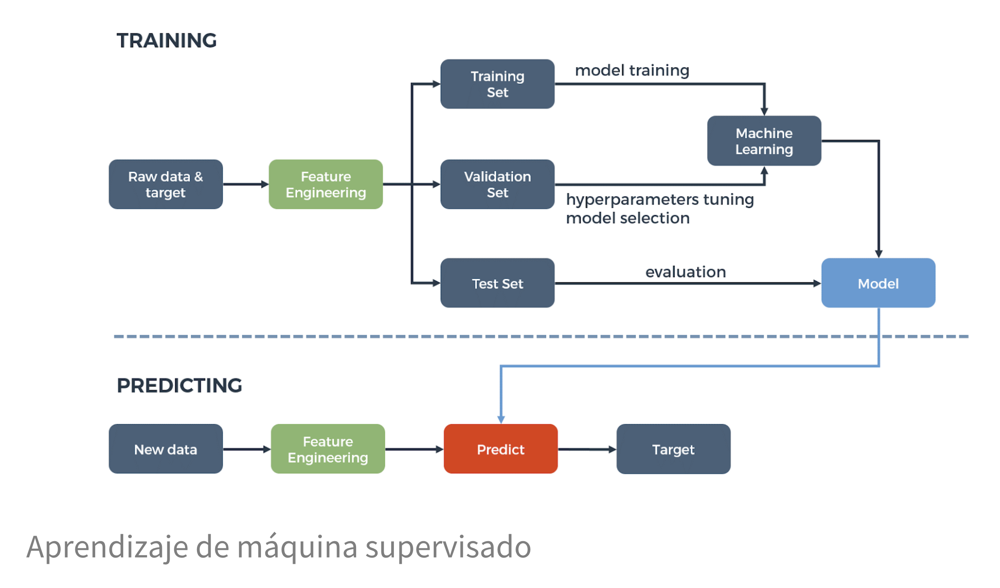
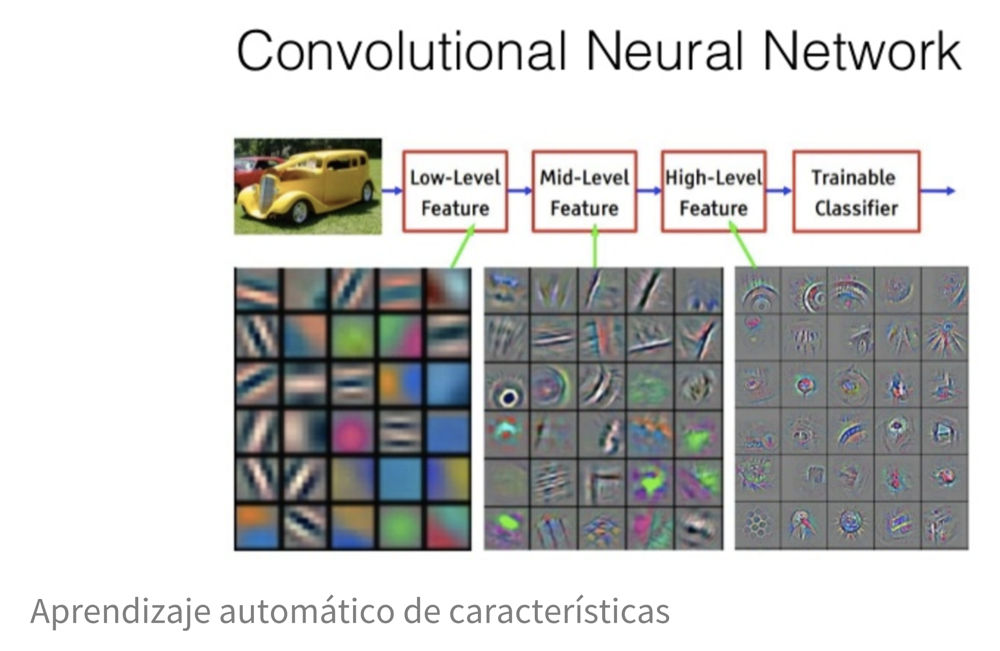
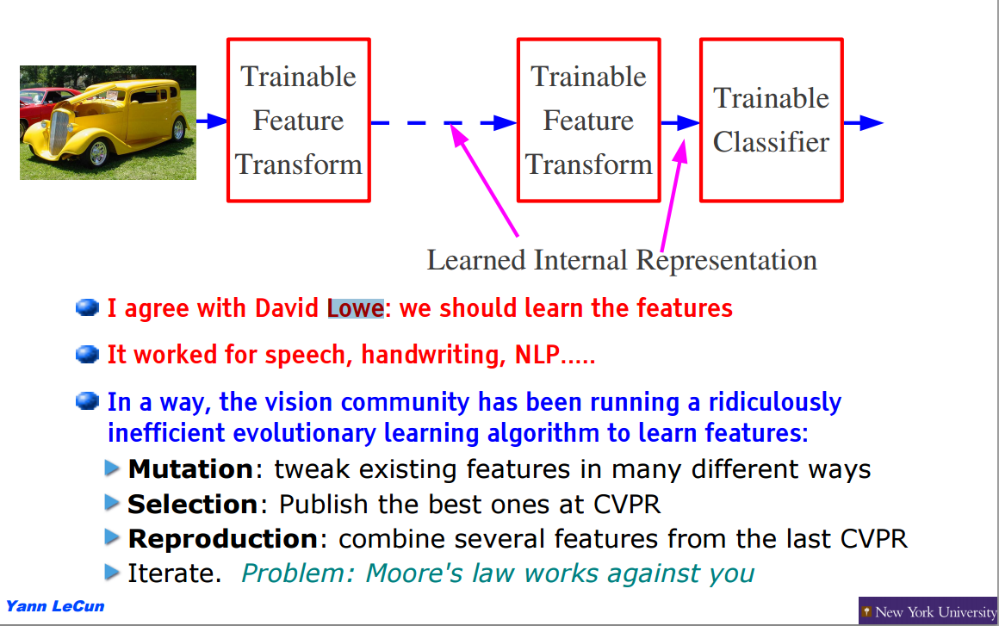
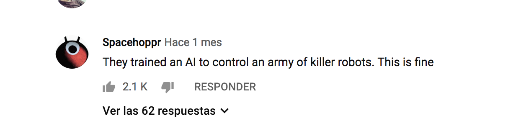

# Clase Viernes 22/marzo/2019 Inecol

* Un Pipeline simple implementado en R - SDMs
* Machine Learning

## Un Pipeline simple implementado en R - SDMs

Se utilizó el paquete de R [drake](https://www.docker.com/) que sirve para generar pipelines relativamente simples con puro R.

El Pipeline en cuestión, permite descargar registros de GBIF de una especie en particular. Luego con base en capas geográficas (e.g. bioclim, productos derivados de Modis, etc) se ajusta un clasificador Random Forest para estimar un SDM.

El repositorio con este ejemplo es el siguiente:

[https://github.com/jequihua/simple_sdm_pipeline.git](https://github.com/jequihua/simple_sdm_pipeline.git)

## Machine Learning

{width=80%}

Es un campo de las ciencias de la computación que, de acuerdo a Arthur Samuel en 1959, le da a las computadoras la habilidad de aprender sin ser explícitamente programadas.

Libros recomendados:

*[The elements of statistical learning](http://web.stanford.edu/~hastie/ElemStatLearn/)
*[Introduction to statistical learning](https://www-bcf.usc.edu/~gareth/ISL/)
*[Pattern recognition and machine learning](https://www.springer.com/gp/book/9780387310732)
*[Mining of Massive Datasets](http://www.mmds.org/)
*[Deep learning](https://www.deeplearningbook.org/)

La primera modalidad de aprendizaje que tiene el machine learning es la de aprendizaje supervisado. Usándola, se entrena al algoritmo otorgándole las preguntas, denominadas características, y las respuestas, denominadas etiquetas. Esto se hace con la finalidad de que el algoritmo las combine y pueda hacer predicciones.

Existen, a su vez, dos tipos de aprendizaje supervisado:

* Regresión: tiene como resultado un número específico. Si las etiquetas suelen ser un valor numérico, mediante las variables de las características, se pueden obtener dígitos como dato resultante.
* Clasificación: en este tipo, el algoritmo encuentra diferentes patrones y tiene por objetivo clasificar los elementos en diferentes grupos.

A diferencia del aprendizaje supervisado, en el no-supervisado solo se le otorgan las características, sin proporcionarle al algoritmo ninguna etiqueta. Su función es la agrupación, por lo que el algoritmo debería catalogar por similitud y poder crear grupos, sin tener la capacidad de definir cómo es cada individualidad de cada uno de los integrantes del grupo.

Por ejemplo, todos los algoritmos de [clustering](https://scikit-learn.org/stable/_images/sphx_glr_plot_cluster_comparison_001.png) cuentan como aprendizaje no-supervisado. Pero también ls técnicas de reducción de dimensión, como componentes principales y escalamiento multidimensional. A su vez las técnicas de minería de datos clásicas como aprendizaje de reglas de asociación también se consideran aprendizaje no-supervisado.

 Anotar 3 ejemplos de aprendizaje supervisado y 3 de aprendizaje no-supervisado en temas de relacionados con biodiversidad.

[Machine Learning cheat sheet](https://www.kdnuggets.com/2018/09/machine-learning-cheat-sheets.html)

{width=80%}

Existe esta broma recurrente de que el Machine Learning es simplemente estadística y que, para venderlo más, ahora se hacen cada vez más referencias a inteligencia artificial.

 Pasen unos minutos recargando [ésta](https://thispersondoesnotexist.com/) página.

## ¿Qué es el deep learning?

*Machine learning basado en redes neuronales
*Extracción automatizada de características
*Robusto ante nuevas observaciones

{width=80%}

{width=80%}

Es un paradigma sumamente poderoso en varias aplicaciones. Por ejemplo en el campo de visión por computadora, aún el inventor de características que antes fueron de las más efectivas (SIFT features) acepta que es mejor aprender las características.

{width=80%}

## ¿Qué es el reinforcement learning?

Es un área del Machine Learning inspirada en la psicología conductista, cuya ocupación es determinar qué acciones debe escoger un agente de software en un entorno dado con el fin de maximizar alguna noción de "recompensa" o premio acumulado.

[maze](https://www.youtube.com/watch?v=TETJx9KeDqE)

[mario bros](https://www.youtube.com/watch?v=5GMDbStRgoc)

[starcraft](https://www.youtube.com/watch?v=TETJx9KeDqE)

{width=80%}

Henry Kissinger, former US secretary of state and a controversial giant of American foreign policy, [believes](https://www.technologyreview.com/the-download/613059/ai-arms-control-may-not-be-possible-warns-henry-kissinger/) it may be a lot harder to control the development of AI weapons than nuclear ones.

Alexandria Ocasio-Cortez [says](https://www.theverge.com/2019/3/10/18258134/alexandria-ocasio-cortez-automation-sxsw-2019) ‘we should be excited about automation’.

